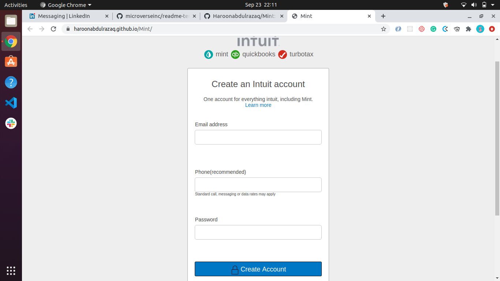

# MINT SIGNUP PAGE

This project is tailored to better understand HTML Forms and CSS Styling using Grid and Flexbox. by cloning Mint clone Sign Up form. 
    

## Built With

- HTML5
- CSS3
- FLEXBOX

## Screenshot


# Getting Started 🚀

[LIVE DEMO LINK](https://haroonabdulrazaq.github.io/Mint/ )

# Getting Started 🚀

These instructions will get you a copy of the project up and running on your local machine.

## How To Use 🔧

From your command line, first clone the project:

```bash
# Clone this repository
$ git clone https://github.com/Haroonabdulrazaq/Mint

# Go into the repository
$ cd Mint

```

## Set up
- Clone this Project to your local machine
- Change directory into this project
- Open it in your prefered IDE(Integrated Development Environment)
## Prerequisite
- Integrated Development Evnvironment

## Test
- [HTML Validator](https://validator.w3.org/)
- CSS code linters

## Deployment
- Deployed Using Github ```gh-pages```

## Authors

👤 **Paul Ogolla**

- Github: [@githubhandle](https://github.com/paulzay)
- Twitter: [@twitterhandle](https://twitter.com/_paulzay_)
- Linkedin: [linkedin](https://linkedin.com/in/paulogolla)


👤 **Haroon Abdulrazaq**

- Github: [@githubhandle](https://github.com/Haroonabdulrazaq)
- Twitter: [@twitterhandle](https://twitter.com/hanq_o)
- Linkedin: [linkedin](https://www.linkedin.com/in/haroonabdulrazaq)

## Show your support

Give a ⭐️ if you like this project!

## Acknowledgments
- We'd like to thank our standup group for reviewing our project.
- We also acknowledge Microverse, the global remote school for developers.
- Lastly we appreciate The Odin Project for creating the project and Flexbox Zombies for teaching Flexbox in a fun way.

## 📝 License

This project is [MIT](lic.url) licensed.
